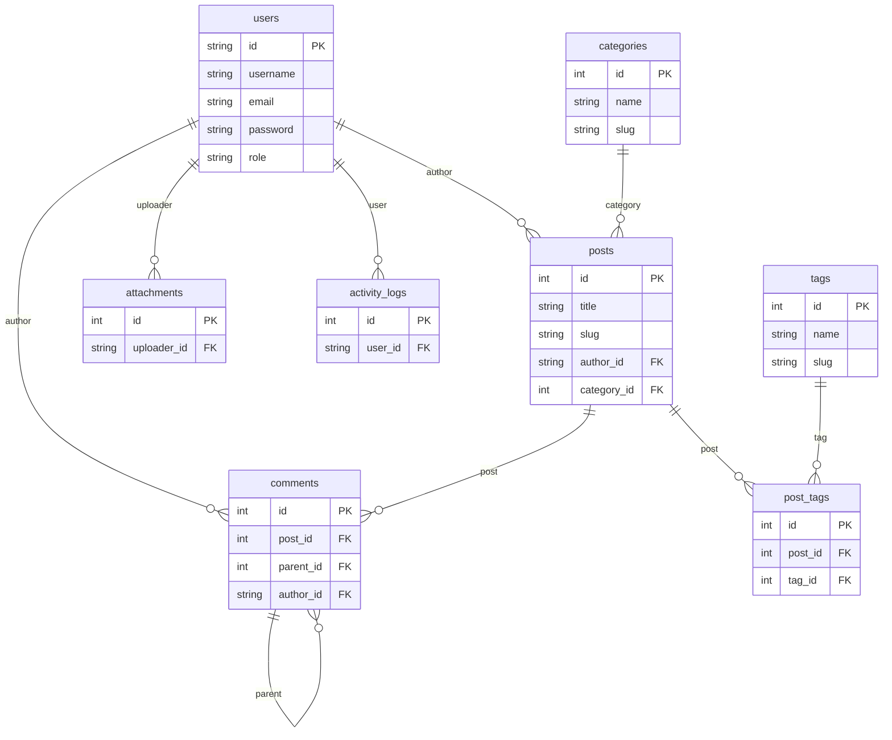

# 数据库信息

## 1. 数据库概述

赛博朋克博客系统使用 MySQL 8.0+ 作为后端数据库，数据库名称为 `cyberpunk_blog`。系统包含多个核心数据表，用于存储用户信息、博客文章、分类标签、评论、页面、系统配置、附件和操作日志等数据。

数据库设计遵循以下原则：
- 使用 utf8mb4 字符集以支持完整的 Unicode 字符，包括 emoji
- 合理设置索引以提高查询性能
- 使用外键约束保证数据完整性
- 采用时间戳字段记录数据创建和更新时间

## 2. 数据表结构

### 2.1 用户表 (users)
存储系统用户信息，包括注册用户和管理员。

| 字段名 | 类型 | 描述 |
|--------|------|------|
| id | VARCHAR(50) | 用户唯一标识，主键 |
| username | VARCHAR(50) | 用户名，唯一 |
| email | VARCHAR(100) | 邮箱地址，唯一 |
| password | VARCHAR(255) | 加密后的密码 |
| role | ENUM('user', 'admin') | 用户角色，默认为'user' |
| avatar_url | VARCHAR(500) | 头像URL |
| bio | TEXT | 个人简介 |
| website | VARCHAR(200) | 个人网站 |
| location | VARCHAR(100) | 所在地 |
| is_active | BOOLEAN | 账户是否激活，默认为TRUE |
| email_verified | BOOLEAN | 邮箱是否验证，默认为FALSE |
| last_login_at | TIMESTAMP | 最后登录时间 |
| created_at | TIMESTAMP | 创建时间，默认为当前时间 |
| updated_at | TIMESTAMP | 更新时间，默认为当前时间，更新时自动刷新 |

### 2.2 博客分类表 (categories)
存储博客文章的分类信息。

| 字段名 | 类型 | 描述 |
|--------|------|------|
| id | INT | 分类ID，主键，自增 |
| name | VARCHAR(50) | 分类名称，唯一 |
| slug | VARCHAR(50) | 分类别名，URL友好，唯一 |
| description | TEXT | 分类描述 |
| color | VARCHAR(7) | 分类颜色（十六进制），默认为'#00f3ff' |
| icon | VARCHAR(50) | 分类图标，默认为'fas fa-folder' |
| sort_order | INT | 排序权重，默认为0 |
| is_active | BOOLEAN | 是否启用，默认为TRUE |
| created_at | TIMESTAMP | 创建时间，默认为当前时间 |
| updated_at | TIMESTAMP | 更新时间，默认为当前时间，更新时自动刷新 |

### 2.3 博客标签表 (tags)
存储博客文章的标签信息。

| 字段名 | 类型 | 描述 |
|--------|------|------|
| id | INT | 标签ID，主键，自增 |
| name | VARCHAR(30) | 标签名称，唯一 |
| slug | VARCHAR(30) | 标签别名，唯一 |
| color | VARCHAR(7) | 标签颜色，默认为'#9600ff' |
| description | VARCHAR(200) | 标签描述 |
| usage_count | INT | 使用次数，默认为0 |
| created_at | TIMESTAMP | 创建时间，默认为当前时间 |
| updated_at | TIMESTAMP | 更新时间，默认为当前时间，更新时自动刷新 |

### 2.4 博客文章表 (posts)
存储博客文章内容。

| 字段名 | 类型 | 描述 |
|--------|------|------|
| id | INT | 文章ID，主键，自增 |
| title | VARCHAR(200) | 文章标题 |
| slug | VARCHAR(200) | 文章别名，URL友好，唯一 |
| excerpt | TEXT | 文章摘要 |
| content | LONGTEXT | 文章内容（Markdown格式） |
| featured_image | VARCHAR(500) | 特色图片URL |
| author_id | VARCHAR(50) | 作者ID，外键关联users表 |
| category_id | INT | 分类ID，外键关联categories表 |
| status | ENUM('draft', 'published', 'archived') | 文章状态，默认为'draft' |
| is_featured | BOOLEAN | 是否推荐，默认为FALSE |
| is_top | BOOLEAN | 是否置顶，默认为FALSE |
| allow_comments | BOOLEAN | 是否允许评论，默认为TRUE |
| view_count | INT | 浏览次数，默认为0 |
| like_count | INT | 点赞次数，默认为0 |
| comment_count | INT | 评论次数，默认为0 |
| word_count | INT | 字数统计，默认为0 |
| reading_time | INT | 预估阅读时长（分钟），默认为0 |
| seo_title | VARCHAR(200) | SEO标题 |
| seo_description | VARCHAR(300) | SEO描述 |
| seo_keywords | VARCHAR(200) | SEO关键词 |
| published_at | TIMESTAMP | 发布时间 |
| created_at | TIMESTAMP | 创建时间，默认为当前时间 |
| updated_at | TIMESTAMP | 更新时间，默认为当前时间，更新时自动刷新 |

### 2.5 文章标签关联表 (post_tags)
存储文章与标签的多对多关联关系。

| 字段名 | 类型 | 描述 |
|--------|------|------|
| id | INT | 关联ID，主键，自增 |
| post_id | INT | 文章ID，外键关联posts表 |
| tag_id | INT | 标签ID，外键关联tags表 |
| created_at | TIMESTAMP | 创建时间，默认为当前时间 |

### 2.6 评论表 (comments)
存储文章评论信息。

| 字段名 | 类型 | 描述 |
|--------|------|------|
| id | INT | 评论ID，主键，自增 |
| post_id | INT | 文章ID，外键关联posts表 |
| parent_id | INT | 父评论ID（用于回复），外键关联comments表 |
| author_id | VARCHAR(50) | 评论者ID（注册用户），外键关联users表 |
| author_name | VARCHAR(50) | 评论者姓名 |
| author_email | VARCHAR(100) | 评论者邮箱 |
| author_website | VARCHAR(200) | 评论者网站 |
| author_ip | VARCHAR(45) | 评论者IP地址 |
| author_user_agent | TEXT | 用户代理信息 |
| content | TEXT | 评论内容 |
| status | ENUM('pending', 'approved', 'spam', 'rejected') | 评论状态，默认为'pending' |
| is_admin_reply | BOOLEAN | 是否为管理员回复，默认为FALSE |
| like_count | INT | 点赞次数，默认为0 |
| reply_count | INT | 回复次数，默认为0 |
| created_at | TIMESTAMP | 创建时间，默认为当前时间 |
| updated_at | TIMESTAMP | 更新时间，默认为当前时间，更新时自动刷新 |

### 2.7 页面表 (pages)
存储静态页面内容，如"关于我们"、"联系我们"等。

| 字段名 | 类型 | 描述 |
|--------|------|------|
| id | INT | 页面ID，主键，自增 |
| title | VARCHAR(200) | 页面标题 |
| slug | VARCHAR(200) | 页面别名，唯一 |
| content | LONGTEXT | 页面内容 |
| template | VARCHAR(50) | 页面模板，默认为'default' |
| status | ENUM('draft', 'published') | 页面状态，默认为'draft' |
| sort_order | INT | 排序权重，默认为0 |
| is_show_in_menu | BOOLEAN | 是否在菜单中显示，默认为FALSE |
| seo_title | VARCHAR(200) | SEO标题 |
| seo_description | VARCHAR(300) | SEO描述 |
| created_at | TIMESTAMP | 创建时间，默认为当前时间 |
| updated_at | TIMESTAMP | 更新时间，默认为当前时间，更新时自动刷新 |

### 2.8 系统配置表 (settings)
存储系统配置项。

| 字段名 | 类型 | 描述 |
|--------|------|------|
| id | INT | 配置ID，主键，自增 |
| key_name | VARCHAR(100) | 配置键名，唯一 |
| value | TEXT | 配置值 |
| description | VARCHAR(500) | 配置描述 |
| type | ENUM('string', 'number', 'boolean', 'json', 'text') | 配置类型，默认为'string' |
| group_name | VARCHAR(50) | 配置分组，默认为'general' |
| is_editable | BOOLEAN | 是否可编辑，默认为TRUE |
| created_at | TIMESTAMP | 创建时间，默认为当前时间 |
| updated_at | TIMESTAMP | 更新时间，默认为当前时间，更新时自动刷新 |

### 2.9 文件附件表 (attachments)
存储上传的文件附件信息。

| 字段名 | 类型 | 描述 |
|--------|------|------|
| id | INT | 附件ID，主键，自增 |
| filename | VARCHAR(255) | 原始文件名 |
| stored_name | VARCHAR(255) | 存储文件名 |
| file_path | VARCHAR(500) | 文件路径 |
| file_url | VARCHAR(500) | 访问URL |
| file_type | VARCHAR(100) | 文件类型 |
| file_size | BIGINT | 文件大小（字节） |
| mime_type | VARCHAR(100) | MIME类型 |
| width | INT | 图片宽度 |
| height | INT | 图片高度 |
| uploader_id | VARCHAR(50) | 上传者ID，外键关联users表 |
| usage_type | ENUM('post', 'avatar', 'general') | 使用类型，默认为'general' |
| usage_count | INT | 引用次数，默认为0 |
| created_at | TIMESTAMP | 创建时间，默认为当前时间 |

### 2.10 操作日志表 (activity_logs)
存储用户操作日志。

| 字段名 | 类型 | 描述 |
|--------|------|------|
| id | INT | 日志ID，主键，自增 |
| user_id | VARCHAR(50) | 操作用户ID，外键关联users表 |
| action | VARCHAR(50) | 操作类型 |
| resource_type | VARCHAR(50) | 资源类型 |
| resource_id | VARCHAR(50) | 资源ID |
| description | VARCHAR(500) | 操作描述 |
| ip_address | VARCHAR(45) | IP地址 |
| user_agent | TEXT | 用户代理 |
| metadata | JSON | 额外元数据 |
| created_at | TIMESTAMP | 创建时间，默认为当前时间 |

## 3. 数据库关系图

## 4. 初始化数据

系统包含以下默认初始化数据：

### 4.1 默认管理员用户
- 用户名: admin
- 邮箱: admin@cyberpunk.blog
- 密码: admin123 (加密存储)
- 角色: admin

### 4.2 默认分类
1. 技术博客 (tech)
2. 生活随笔 (life)
3. 学习笔记 (notes)
4. 项目实战 (projects)

### 4.3 默认标签
1. JavaScript
2. Node.js
3. 前端开发
4. 数据库
5. 赛博朋克

### 4.4 系统配置
- site_title: 赛博朋克博客
- site_description: 探索数字世界的无限可能
- posts_per_page: 10
- allow_registration: true

### 4.5 默认页面
1. 关于我们 (about)
2. 联系我们 (contact)
3. 隐私政策 (privacy)